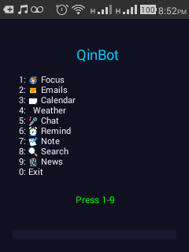
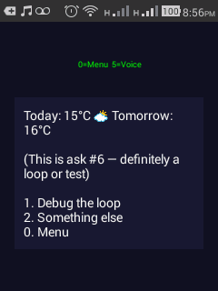
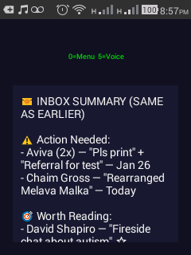
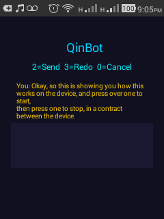
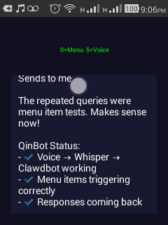
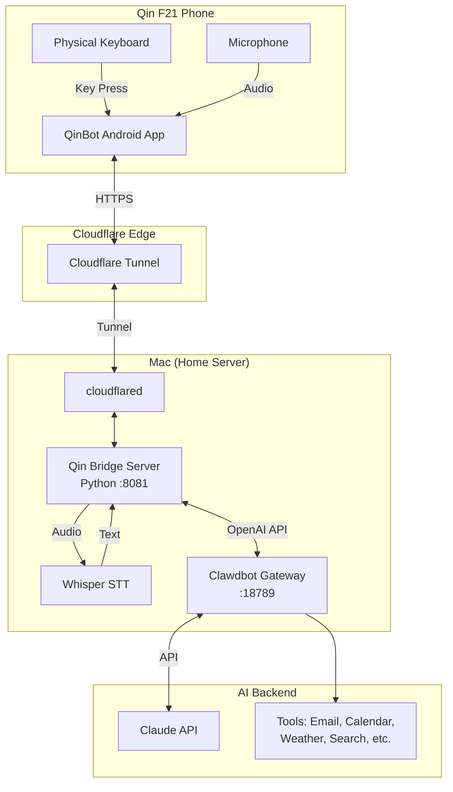
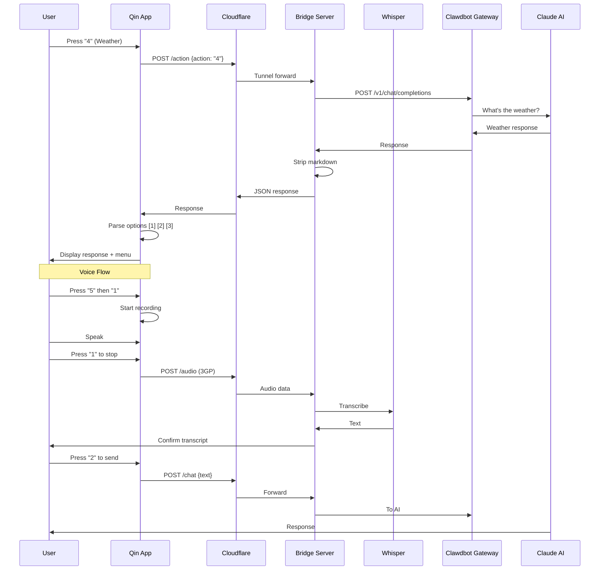

# QinBot: AI Assistant for Non-Smartphone Users

> **The most capable "kosher phone" on the planet** — Full AI assistant on a device with no browser, no apps, no images.


-green.svg)


## 🎯 The Problem

Smartphones are designed to be addictive. For people who want to disconnect — whether for religious reasons, mental health, productivity, or digital minimalism — the choice has always been:

- **Full smartphone** → All the capability, all the addiction
- **Dumb phone** → No addiction, no capability

**QinBot solves this.** You get 90% of the utility with 10% of the risk.

## 💡 The Solution

QinBot turns a $50 non-touchscreen Android phone (Qin F21 Pro) into a powerful AI assistant:

- ✅ Check emails
- ✅ Get weather forecasts
- ✅ Manage calendar
- ✅ Take voice notes
- ✅ Search the web (text results only)
- ✅ Get news briefings
- ✅ Draft and send emails
- ✅ Set reminders
- ✅ Free-form AI chat

**Without:**
- ❌ Browser
- ❌ Images from internet
- ❌ Video
- ❌ Social media
- ❌ Infinite scroll
- ❌ App Store

## 📱 Screenshots

<table>
<tr>
<td><br/><b>Main Menu</b></td>
<td><br/><b>Weather</b></td>
<td><br/><b>Email Summary</b></td>
</tr>
<tr>
<td><br/><b>Voice Input</b></td>
<td><br/><b>AI Response</b></td>
<td><br/><b>News Briefing</b></td>
</tr>
</table>

## 🏗️ Architecture



## 🔄 Request Flow



## 📁 Project Structure

```
~/qin/
├── qin_clawdbot_server.py    # Bridge server (Python)
├── start_tunnel.sh           # Cloudflare tunnel launcher
├── build_and_install.sh      # APK build script
├── README.md                 # This file
├── demo-screenshots/         # Demo images
│   ├── 01-qinbot-main-menu.png
│   ├── 02-focus-recap-response.png
│   ├── ...
└── QinFeedback/              # Android app source
    └── app/
        └── src/
            └── main/
                └── java/
                    └── com/qin/feedback/
                        └── MainActivity.java
```

## 🔧 Components

### 1. Android App (QinFeedback)

**Location:** `QinFeedback/app/src/main/java/com/qin/feedback/MainActivity.java`

The Android app is designed for the Qin F21's unique constraints:
- No touchscreen — all interaction via physical numpad
- Small screen (240x320) — maximized text area
- Limited resources — minimal dependencies

**Key Features:**
- Server-driven menu (fetched from `/menu` endpoint)
- Dynamic response options (parses `[1] Option` from AI responses)
- Voice recording with confirmation flow
- State machine for navigation

**States:**
```java
STATE_MENU          // Main menu
STATE_VOICE_PROMPT  // "Press 1 to speak"
STATE_RECORDING     // Recording audio
STATE_CONFIRM       // Confirm transcript
STATE_SENDING       // Waiting for response
STATE_RESPONSE      // Viewing AI response
```

### 2. Bridge Server (Python)

**Location:** `qin_clawdbot_server.py`

HTTP server that bridges the Qin app to Clawdbot:

**Endpoints:**
| Endpoint | Method | Description |
|----------|--------|-------------|
| `/health` | GET | Health check |
| `/menu` | GET | Get menu configuration |
| `/action` | POST | Execute menu action |
| `/audio` | POST | Upload audio for transcription |
| `/chat` | POST | Send text to AI |

**Key Functions:**
- `strip_markdown()` — Converts markdown to plain text for Qin display
- `forward_to_clawdbot()` — Sends requests to Clawdbot's OpenAI-compatible API
- Audio processing: 3GP → WAV → Whisper → Text

**Menu Configuration:**
```python
MENU_CONFIG = {
    "title": "🤖 QinBot",
    "items": {
        "1": {"label": "🎯 Focus", "type": "instant", "command": "..."},
        "2": {"label": "📧 Emails", "type": "instant", "command": "..."},
        "3": {"label": "📅 Calendar", "type": "instant", "command": "..."},
        "4": {"label": "🌤️ Weather", "type": "instant", "command": "..."},
        "5": {"label": "🎤 Chat", "type": "voice", "prompt": "What do you want to say?"},
        "6": {"label": "⏰ Remind", "type": "voice", "prompt": "..."},
        "7": {"label": "📝 Note", "type": "voice", "prompt": "..."},
        "8": {"label": "🔍 Search", "type": "voice", "prompt": "..."},
        "9": {"label": "📰 News", "type": "instant", "command": "..."}
    }
}
```

### 3. Cloudflare Tunnel

**Purpose:** Expose the local bridge server to the internet with a permanent URL.

**URL:** `https://qin.mordechaipotash.com`

**Why Cloudflare Tunnel?**
- No port forwarding needed
- HTTPS by default
- Survives IP changes
- DDoS protection included

### 4. Clawdbot Gateway

**Port:** 18789

Clawdbot is a self-hosted AI gateway that provides:
- OpenAI-compatible API (`/v1/chat/completions`)
- Tool execution (email, calendar, weather, search)
- Session management
- Multi-model routing

## 🚀 Installation

### Prerequisites

- Mac (Apple Silicon or Intel)
- Qin F21 Pro phone
- Android SDK (for `adb`)
- Python 3.9+
- Node.js 18+
- Homebrew

### Step 1: Install Dependencies

```bash
# Whisper (speech-to-text)
pipx install openai-whisper

# FFmpeg (audio conversion)
brew install ffmpeg

# Cloudflared (tunnel)
brew install cloudflared

# Android build tools
brew install --cask android-commandlinetools
```

### Step 2: Clone and Configure

```bash
git clone https://github.com/mordechaipotash/qinbot.git ~/qin
cd ~/qin

# Edit server config if needed
nano qin_clawdbot_server.py
```

### Step 3: Set Up Cloudflare Tunnel

```bash
# Login to Cloudflare
cloudflared tunnel login

# Create named tunnel
cloudflared tunnel create qin

# Configure DNS (in Cloudflare dashboard)
# Add CNAME: qin.yourdomain.com → <tunnel-id>.cfargotunnel.com
```

### Step 4: Create LaunchAgents

**Bridge Server** (`~/Library/LaunchAgents/com.qin.clawdbot-bridge.plist`):
```xml
<?xml version="1.0" encoding="UTF-8"?>
<!DOCTYPE plist PUBLIC "-//Apple//DTD PLIST 1.0//EN" "http://www.apple.com/DTDs/PropertyList-1.0.dtd">
<plist version="1.0">
<dict>
    <key>Label</key>
    <string>com.qin.clawdbot-bridge</string>
    <key>ProgramArguments</key>
    <array>
        <string>/usr/bin/python3</string>
        <string>/Users/YOUR_USERNAME/qin/qin_clawdbot_server.py</string>
    </array>
    <key>WorkingDirectory</key>
    <string>/Users/YOUR_USERNAME/qin</string>
    <key>EnvironmentVariables</key>
    <dict>
        <key>PATH</key>
        <string>/opt/homebrew/bin:/usr/local/bin:/usr/bin:/bin</string>
    </dict>
    <key>RunAtLoad</key>
    <true/>
    <key>KeepAlive</key>
    <true/>
    <key>StandardOutPath</key>
    <string>/tmp/qin-server.log</string>
    <key>StandardErrorPath</key>
    <string>/tmp/qin-server.err</string>
</dict>
</plist>
```

**Cloudflare Tunnel** (`~/Library/LaunchAgents/com.qin.cloudflared-tunnel.plist`):
```xml
<?xml version="1.0" encoding="UTF-8"?>
<!DOCTYPE plist PUBLIC "-//Apple//DTD PLIST 1.0//EN" "http://www.apple.com/DTDs/PropertyList-1.0.dtd">
<plist version="1.0">
<dict>
    <key>Label</key>
    <string>com.qin.cloudflared-tunnel</string>
    <key>ProgramArguments</key>
    <array>
        <string>/opt/homebrew/bin/cloudflared</string>
        <string>tunnel</string>
        <string>run</string>
        <string>--token</string>
        <string>YOUR_TUNNEL_TOKEN</string>
    </array>
    <key>RunAtLoad</key>
    <true/>
    <key>KeepAlive</key>
    <true/>
    <key>StandardOutPath</key>
    <string>/tmp/qin-tunnel.log</string>
    <key>StandardErrorPath</key>
    <string>/tmp/qin-tunnel.err</string>
</dict>
</plist>
```

Load the agents:
```bash
launchctl load ~/Library/LaunchAgents/com.qin.clawdbot-bridge.plist
launchctl load ~/Library/LaunchAgents/com.qin.cloudflared-tunnel.plist
```

### Step 5: Build and Install Android App

```bash
# Connect Qin via USB
adb devices

# Build and install
export JAVA_HOME=/opt/homebrew/opt/openjdk@17
cd ~/qin
./build_and_install.sh
```

### Step 6: Configure App Server URL

Edit `QinFeedback/app/src/main/java/com/qin/feedback/MainActivity.java`:
```java
private static final String SERVER_BASE = "https://qin.yourdomain.com";
```

Rebuild and install.

## ⚙️ Configuration

### Adding New Menu Items

Edit `MENU_CONFIG` in `qin_clawdbot_server.py`:

```python
"10": {
    "label": "🏠 Home",
    "type": "instant",
    "command": "Check my smart home status"
}
```

**Types:**
- `instant` — Executes immediately with predefined command
- `voice` — Prompts for voice input, then executes

### Customizing AI Behavior

The bridge server injects instructions for Qin-friendly responses:

```python
enhanced_text = text + """
[IMPORTANT - QIN INTERFACE RULES:
User can ONLY respond by: pressing a number (1-9, 0) OR voice recording.

End EVERY response with 2-5 numbered options:
[1] Most likely next action
[2] Second most likely  
[3] Alternative
[0] ← Back/Menu

Keep options SHORT (≤25 chars).]"""
```

### Markdown Stripping

The `strip_markdown()` function converts:
- `## Headers` → `HEADERS` (caps)
- `**bold**` → `bold`
- `| tables |` → `- lists`
- Code blocks → removed
- Multiple blank lines → single

## 🔒 Security Considerations

1. **Token Storage:** The Clawdbot gateway token is stored in the Python script and LaunchAgent. Consider using environment variables or a secrets manager for production.

2. **Tunnel Security:** The Cloudflare tunnel is authenticated. Only requests through the tunnel reach your server.

3. **No Data on Phone:** The Qin stores nothing — all data flows through the server. Losing the phone = zero data exposure.

4. **Network Isolation:** The bridge server only listens on localhost. External access is only via the authenticated tunnel.

## 🐛 Troubleshooting

### Server not responding
```bash
# Check if running
launchctl list | grep qin

# View logs
tail -f /tmp/qin-server.log
tail -f /tmp/qin-server.err
```

### Voice not working
```bash
# Check Whisper
which whisper

# Check FFmpeg
which ffmpeg

# Test manually
whisper /tmp/test.wav --model tiny
```

### Tunnel not connecting
```bash
# Check tunnel status
curl https://qin.yourdomain.com/health

# View tunnel logs
tail -f /tmp/qin-tunnel.log
```

### App crashes
```bash
# View Android logs
adb logcat | grep -i qin
```

## 📊 Performance

| Operation | Time |
|-----------|------|
| Menu load | ~200ms |
| Instant action | 2-5s |
| Voice transcription | 3-8s |
| Full voice round-trip | 8-15s |

## 🗺️ Roadmap

- [ ] Hebrew voice recognition
- [ ] Offline mode (cached responses)
- [ ] Multiple user profiles
- [ ] Home Assistant integration
- [ ] WhatsApp message reading
- [ ] Calendar event creation

## 🙏 Acknowledgments

- [Clawdbot](https://github.com/clawdbot/clawdbot) — AI gateway
- [OpenAI Whisper](https://github.com/openai/whisper) — Speech recognition
- [Cloudflare Tunnel](https://developers.cloudflare.com/cloudflare-one/connections/connect-apps/) — Secure tunneling
- [Qin F21 Pro](https://www.duoqin.com/) — The hardware

## 📄 License

MIT License — See [LICENSE](LICENSE) for details.

---

**Built with ❤️ for the digital minimalism community.**

*"The constraint creates freedom."*
