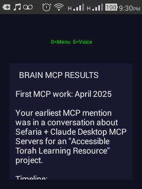
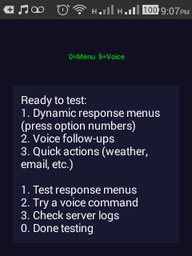
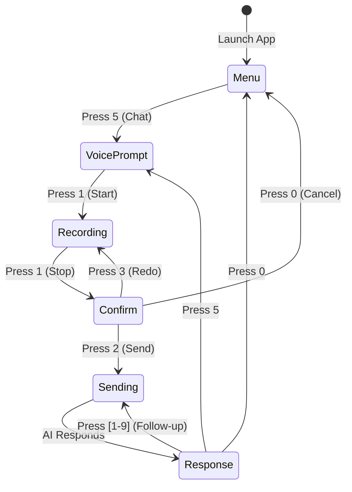
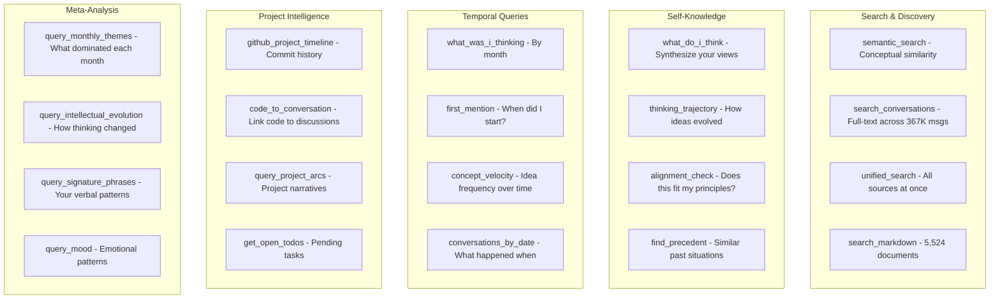
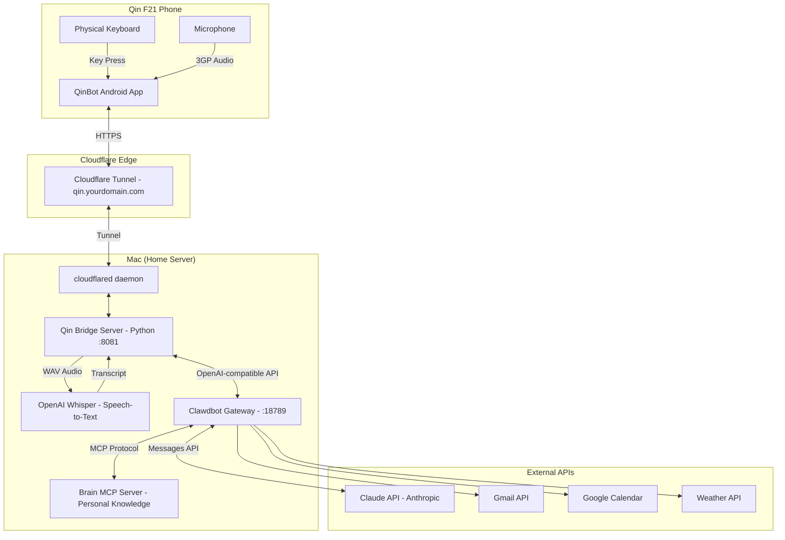
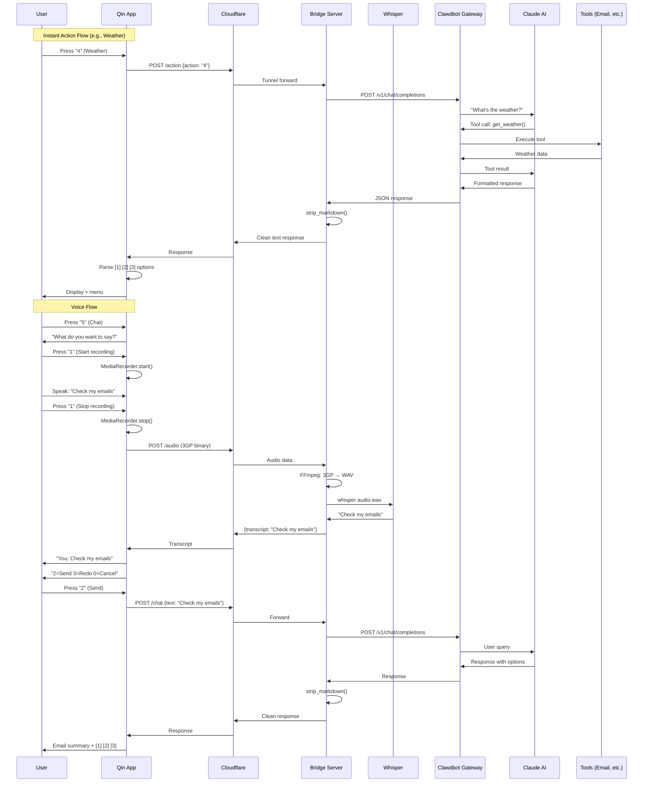

# QinBot: AI Assistant for Non-Smartphone Users

> **The most capable "kosher phone" on the planet** — Full AI assistant on a device with no browser, no apps, no images.


-green.svg)


## 🎯 The Problem

Smartphones are designed to be addictive. For people who want to disconnect — whether for religious reasons, mental health, productivity, or digital minimalism — the choice has always been:

- **Full smartphone** → All the capability, all the addiction
- **Dumb phone** → No addiction, no capability

**QinBot solves this.** You get 90% of the utility with 10% of the risk.

## 💡 The Solution

QinBot turns a $50 non-touchscreen Android phone (Qin F21 Pro) into a powerful AI assistant:

- ✅ Check emails
- ✅ Get weather forecasts
- ✅ Manage calendar
- ✅ Take voice notes
- ✅ Search the web (text results only)
- ✅ Get news briefings
- ✅ Draft and send emails
- ✅ Set reminders
- ✅ Query your personal knowledge base (Brain MCP)
- ✅ Free-form AI chat

**Without:**
- ❌ Browser
- ❌ Images from internet
- ❌ Video
- ❌ Social media
- ❌ Infinite scroll
- ❌ App Store

## 📱 Screenshots

<table>
<tr>
<td><br/><b>Main Menu</b></td>
<td><br/><b>Weather</b></td>
<td><br/><b>Email Summary</b></td>
</tr>
<tr>
<td><br/><b>Voice Input</b></td>
<td><br/><b>AI Response</b></td>
<td><br/><b>News Briefing</b></td>
</tr>
<tr>
<td><br/><b>Brain MCP Query</b></td>
<td><br/><b>Email Draft</b></td>
<td><br/><b>Dynamic Options</b></td>
</tr>
</table>

---

## 🎤 Why Voice? The Qin Input Problem

### The Challenge

The Qin F21 Pro has a **T9 physical keypad** — the same input method from 2003 Nokia phones. Typing "Hello, how are you?" requires pressing:

```
4-4 3-3 5-5-5 5-5-5 6-6-6 [space] 4-4 6-6-6 9-9-9 [space] 2 7-7-7 3-3 [space] 9-9-9 6-6-6 8-8 [?]
```

That's **~50 key presses** for a simple sentence. For anything beyond "ok" or "yes", T9 is impractical.

### The Solution: Voice-First Design

QinBot is designed **voice-first**. Instead of typing, you:

1. **Press a number** to select a menu item
2. **Speak** your message naturally
3. **Confirm** with a single key press

The AI handles the rest — understanding context, executing actions, and responding with numbered options you can select with one press.

### The Voice Recording Flow



**Step-by-step:**

| Step | Screen Shows | User Action | What Happens |
|------|-------------|-------------|--------------|
| 1 | `"What do you want to say?"` | Press **1** | Recording starts 🔴 |
| 2 | `"Recording... Press 1 to stop"` | Speak naturally | Audio captured |
| 3 | `"Recording... Press 1 to stop"` | Press **1** | Recording stops, sent to Whisper |
| 4 | `"You: [transcript]"` | Review transcript | Confirm it's correct |
| 5 | `"2=Send 3=Redo 0=Cancel"` | Press **2** | Sent to AI |
| 6 | AI response with options | Press **1-9** | Follow-up action |

### Why This Flow?

- **Press 1 to start, Press 1 to stop**: Same key = muscle memory. No hunting for different buttons.
- **Confirmation step**: Whisper isn't perfect. Let the user verify before sending.
- **Redo option**: Bad recording? Just press 3 and try again. No penalty.
- **Numbered follow-ups**: AI responses include `[1] [2] [3]` options. Keep the conversation going without typing.

---

## 🧠 Brain MCP: Your Intellectual DNA

### What is Brain MCP?

Brain MCP is a **queryable archive of your entire intellectual history** — every conversation, every search, every project, every decision. It's not just storage; it's a system that understands *how you think*.

**The Real Numbers:**

| Source | Count |
|--------|-------|
| **Conversations** | 367,684 messages (132,815 from user) |
| **Embeddings** | 107,682 semantic vectors (768-dimensional, LanceDB) |
| **GitHub** | 132 repositories, 1,427 commits |
| **YouTube** | 31,832 videos tracked (16,386 watched) |
| **Google Searches** | 52,791 queries |
| **Google Visits** | 58,650 page visits |
| **Markdown Docs** | 5,524 documents |

### The 8 Universal Principles (SEED)

Brain MCP has extracted **8 foundational mental models** from analyzing hundreds of thousands of messages:

| Principle | Description | Mentions |
|-----------|-------------|----------|
| **INVERSION** | Reverse the problem to find the solution | 1,415 |
| **TRANSLATION LAYER** | Interface between infinite AI output and finite human comprehension | 610 |
| **COMPRESSION** | Reduce complexity while preserving decision quality | 594 |
| **AGENCY PRESERVATION** | 100% human decision control, 100% machine execution | 395 |
| **TEMPORAL ECONOMICS** | Human time as the ultimate scarce resource | 71 |
| **BOTTLENECK AMPLIFICATION** | Find constraints and amplify them as leverage | 57 |
| **COGNITIVE ARCHITECTURE** | Design systems that amplify YOUR specific mind | 18 |
| **SEEDS & SOVEREIGNTY** | Autonomous, bounded systems with clear interfaces | 17 |

### 92 Query Tools

Brain MCP exposes **92 specialized tools** for querying your intellectual DNA:



### Example Queries from Qin

From your dumb phone, you can ask:

| Query | What Brain MCP Does |
|-------|---------------------|
| *"What do I think about AI agents?"* | Synthesizes your views from 1,415 mentions of agency/agents |
| *"When did I first work on MCP?"* | Finds earliest mention across all conversations |
| *"Am I being consistent with my principles?"* | Runs alignment_check against SEED principles |
| *"What was I obsessed with in October?"* | Pulls monthly themes and focus areas |
| *"Find similar situations to this decision"* | Semantic search for precedents |

### Architecture

```mermaid
graph LR
    subgraph "Qin Phone"
        Q[Voice: "What was I - thinking in April?"]
    end
    
    subgraph "Mac Server"
        B[Bridge Server]
        G[Clawdbot Gateway]
        MCP[Brain MCP Server - Python + FastMCP]
        DB[(SQLite - 367K messages)]
        LANCE[(LanceDB - 107K embeddings)]
    end
    
    Q -->|HTTPS| B
    B -->|API| G
    G -->|MCP Tool Call| MCP
    MCP -->|SQL| DB
    MCP -->|Vector Search| LANCE
    MCP -->|Results| G
    G -->|Natural Language| B
    B -->|Plain Text| Q
```

### Privacy & Sovereignty

- **100% Local**: Brain MCP runs on YOUR Mac. Nothing uploaded to cloud.
- **You Own Your Data**: SQLite + LanceDB files you can backup, export, delete.
- **AI Queries Locally**: Claude sees query results, not raw data.
- **Offline Capable**: Brain queries work even without internet (only AI response needs connection).

This is the **"Intellectual DNA"** concept — your thoughts, patterns, and decisions are searchable and queryable, turning years of scattered conversations into a coherent, accessible knowledge base.

---

## 🏗️ Architecture



## 🔄 Complete Request Flow



---

## 📁 Project Structure

```
~/qin/
├── qin_clawdbot_server.py    # Bridge server (Python)
├── start_tunnel.sh           # Cloudflare tunnel launcher
├── build_and_install.sh      # APK build script
├── README.md                 # This file
├── LICENSE                   # MIT License
├── .gitignore
├── demo-screenshots/         # Demo images
│   ├── 01-qinbot-main-menu.png
│   ├── 02-focus-recap-response.png
│   ├── 03-weather-response.png
│   ├── ...
│   └── 14-brain-mcp-query.png
└── QinFeedback/              # Android app source
    └── app/
        ├── build.gradle
        └── src/
            └── main/
                ├── AndroidManifest.xml
                └── java/
                    └── com/qin/feedback/
                        └── MainActivity.java
```

## 🔧 Components

### 1. Android App (QinFeedback)

**Location:** `QinFeedback/app/src/main/java/com/qin/feedback/MainActivity.java`

The Android app is designed for the Qin F21's unique constraints:
- **No touchscreen** — all interaction via physical numpad (0-9, *, #)
- **Small screen** (240x320) — maximized text area, hidden headers during responses
- **Limited resources** — minimal dependencies, no heavy frameworks

**State Machine:**
```java
STATE_MENU          // Main menu - showing 9 options
STATE_VOICE_PROMPT  // "Press 1 to speak"
STATE_RECORDING     // Recording audio (red indicator)
STATE_CONFIRM       // "2=Send 3=Redo 0=Cancel"
STATE_SENDING       // Waiting for response (yellow spinner)
STATE_RESPONSE      // Viewing AI response with [1][2][3] options
```

**Key Features:**
- **Server-driven menu**: Menu items fetched from `/menu` endpoint — add features without rebuilding APK
- **Dynamic response parsing**: Regex extracts `[1] Option` or `1. Option` patterns from AI responses
- **Audio recording**: Uses Android MediaRecorder, outputs 3GP format
- **Minimal UI**: Title hides during responses to maximize text space

### 2. Bridge Server (Python)

**Location:** `qin_clawdbot_server.py`

Lightweight HTTP server bridging Qin to Clawdbot:

**Endpoints:**
| Endpoint | Method | Description |
|----------|--------|-------------|
| `/health` | GET | Health check (`{"status": "ok"}`) |
| `/menu` | GET | Return menu configuration JSON |
| `/action` | POST | Execute instant action by key |
| `/audio` | POST | Receive 3GP, transcribe, return text |
| `/chat` | POST | Forward text to AI, return response |

**Audio Pipeline:**
```
3GP (from phone) → FFmpeg → WAV (16kHz mono) → Whisper → Text
```

**Response Processing:**
```python
def strip_markdown(text):
    # Headers → CAPS
    # **bold** → bold
    # | tables | → - lists
    # ``` code ``` → removed
    # Multiple newlines → single
```

**AI Instruction Injection:**
Every request to the AI includes:
```
[IMPORTANT - QIN INTERFACE RULES:
User can ONLY respond by: pressing a number (1-9, 0) OR voice recording.
End EVERY response with 2-5 numbered options:
[1] Most likely next action
[2] Second most likely  
[0] ← Back/Menu
Keep options SHORT (≤25 chars).]
```

### 3. Cloudflare Tunnel

**Purpose:** Secure, permanent URL for the phone to reach your home server.

**Why not port forwarding?**
- ISPs block ports / use CGNAT
- Dynamic IPs change
- No HTTPS certificate hassle
- Built-in DDoS protection

**Setup:**
```bash
# One-time: Create named tunnel
cloudflared tunnel create qin

# Add DNS record in Cloudflare dashboard
# CNAME: qin → <tunnel-id>.cfargotunnel.com

# Run with token (in LaunchAgent)
cloudflared tunnel run --token <token>
```

### 4. Clawdbot Gateway

**Port:** 18789

Self-hosted AI gateway providing:
- **OpenAI-compatible API** (`/v1/chat/completions`)
- **Tool execution**: Email (gog), Calendar, Weather, Web Search, Brain MCP
- **Session management**: Persistent conversation context
- **Model routing**: Switch between Claude models

**API Call:**
```python
POST http://127.0.0.1:18789/v1/chat/completions
Headers:
  Authorization: Bearer <token>
  Content-Type: application/json
  x-clawdbot-agent-id: main

Body:
{
  "model": "clawdbot:main",
  "messages": [{"role": "user", "content": "..."}],
  "user": "qin"
}
```

---

## 🚀 Installation

### Prerequisites

- Mac (Apple Silicon or Intel)
- Qin F21 Pro phone
- Android SDK (`adb`)
- Python 3.9+
- Node.js 18+ (for Clawdbot)
- Homebrew

### Step 1: Install Dependencies

```bash
# Whisper (speech-to-text)
pipx install openai-whisper

# FFmpeg (audio conversion)  
brew install ffmpeg

# Cloudflared (tunnel)
brew install cloudflared

# Java (for Android builds)
brew install openjdk@17
```

### Step 2: Clone Repository

```bash
git clone https://github.com/mordechaipotash/qinbot.git ~/qin
cd ~/qin
```

### Step 3: Configure Server

Edit `qin_clawdbot_server.py`:
```python
# Set your Clawdbot gateway token
CLAWDBOT_TOKEN = "your-token-here"

# Paths to binaries (if different)
WHISPER_PATH = "/Users/you/.local/bin/whisper"
FFMPEG_PATH = "/opt/homebrew/bin/ffmpeg"
```

### Step 4: Set Up Cloudflare Tunnel

```bash
# Login (opens browser)
cloudflared tunnel login

# Create tunnel
cloudflared tunnel create qin

# Note the tunnel ID and token
```

In Cloudflare dashboard:
1. Go to **Zero Trust → Networks → Tunnels**
2. Click your tunnel → **Public Hostname**
3. Add: `qin.yourdomain.com` → `http://localhost:8081`

### Step 5: Create LaunchAgents

See [LaunchAgent templates](#launchagent-templates) below.

```bash
# Load agents
launchctl load ~/Library/LaunchAgents/com.qin.clawdbot-bridge.plist
launchctl load ~/Library/LaunchAgents/com.qin.cloudflared-tunnel.plist
```

### Step 6: Build Android App

```bash
# Connect Qin via USB
adb devices

# Set server URL in MainActivity.java
# SERVER_BASE = "https://qin.yourdomain.com"

# Build and install
export JAVA_HOME=/opt/homebrew/opt/openjdk@17
./build_and_install.sh
```

---

## 📋 LaunchAgent Templates

### Bridge Server

`~/Library/LaunchAgents/com.qin.clawdbot-bridge.plist`:
```xml
<?xml version="1.0" encoding="UTF-8"?>
<!DOCTYPE plist PUBLIC "-//Apple//DTD PLIST 1.0//EN" 
  "http://www.apple.com/DTDs/PropertyList-1.0.dtd">
<plist version="1.0">
<dict>
    <key>Label</key>
    <string>com.qin.clawdbot-bridge</string>
    <key>ProgramArguments</key>
    <array>
        <string>/usr/bin/python3</string>
        <string>/Users/YOUR_USER/qin/qin_clawdbot_server.py</string>
    </array>
    <key>WorkingDirectory</key>
    <string>/Users/YOUR_USER/qin</string>
    <key>EnvironmentVariables</key>
    <dict>
        <key>PATH</key>
        <string>/opt/homebrew/bin:/usr/local/bin:/usr/bin:/bin:/Users/YOUR_USER/.local/bin</string>
    </dict>
    <key>RunAtLoad</key><true/>
    <key>KeepAlive</key><true/>
    <key>StandardOutPath</key>
    <string>/tmp/qin-server.log</string>
    <key>StandardErrorPath</key>
    <string>/tmp/qin-server.err</string>
</dict>
</plist>
```

### Cloudflare Tunnel

`~/Library/LaunchAgents/com.qin.cloudflared-tunnel.plist`:
```xml
<?xml version="1.0" encoding="UTF-8"?>
<!DOCTYPE plist PUBLIC "-//Apple//DTD PLIST 1.0//EN" 
  "http://www.apple.com/DTDs/PropertyList-1.0.dtd">
<plist version="1.0">
<dict>
    <key>Label</key>
    <string>com.qin.cloudflared-tunnel</string>
    <key>ProgramArguments</key>
    <array>
        <string>/opt/homebrew/bin/cloudflared</string>
        <string>tunnel</string>
        <string>run</string>
        <string>--token</string>
        <string>YOUR_TUNNEL_TOKEN_HERE</string>
    </array>
    <key>RunAtLoad</key><true/>
    <key>KeepAlive</key><true/>
    <key>StandardOutPath</key>
    <string>/tmp/qin-tunnel.log</string>
    <key>StandardErrorPath</key>
    <string>/tmp/qin-tunnel.err</string>
</dict>
</plist>
```

---

## 🐛 Troubleshooting

### "Server 500" on voice
```bash
# Check Whisper path
which whisper
# Should be in LaunchAgent PATH

# Check logs
tail -f /tmp/qin-server.err
```

### Dynamic options not working
The AI must format options as `[1] Text` or `1. Text`. Check:
```bash
# Test API response
curl -X POST http://localhost:8081/action \
  -H "Content-Type: application/json" \
  -d '{"action": "4"}'
```

### Tunnel not connecting
```bash
# Check tunnel status  
curl https://qin.yourdomain.com/health

# Check logs
tail -f /tmp/qin-tunnel.err
```

---

## 📊 Performance

| Operation | Time |
|-----------|------|
| Menu load | ~200ms |
| Instant action (weather) | 2-5s |
| Voice recording upload | 1-2s |
| Whisper transcription | 3-8s |
| Full voice round-trip | 8-15s |

---

## 🙏 Acknowledgments

- [Clawdbot](https://github.com/clawdbot/clawdbot) — AI gateway with tools
- [OpenAI Whisper](https://github.com/openai/whisper) — Speech recognition
- [Cloudflare Tunnel](https://developers.cloudflare.com/cloudflare-one/connections/connect-apps/) — Secure tunneling
- [Qin F21 Pro](https://www.duoqin.com/) — The hardware that makes this possible

---

## 📄 License

MIT License — See [LICENSE](LICENSE) for details.

---

<div align="center">

**Built with ❤️ for the digital minimalism community.**

*"The constraint creates freedom."*

</div>
