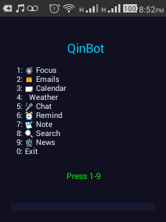
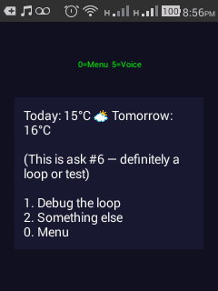
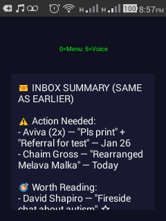
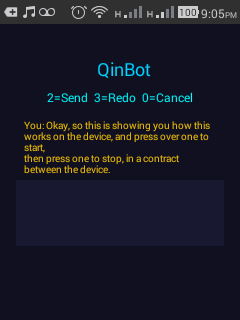
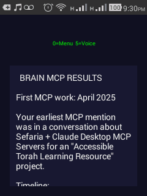
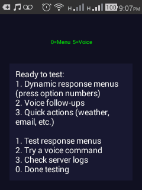
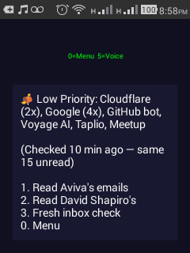
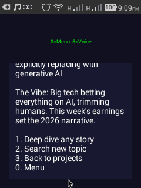
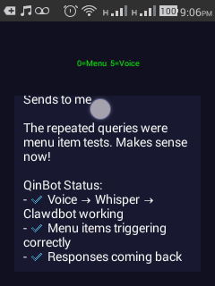
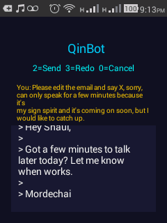

# QinBot

> **Full AI assistant on a $50 phone with no browser, no apps, no touchscreen.**


https://github.com/user-attachments/assets/2474b03e-0d2d-4d3d-b9dc-9d4293dfc009


---

## The Problem

Smartphones are designed to be addictive. For people who want to disconnect — religious reasons, mental health, digital minimalism — the choice has always been:

**Full smartphone** → all the capability, all the addiction  
**Dumb phone** → no addiction, no capability

**QinBot solves this.** 90% of the utility, 10% of the risk.

---

## What It Does

A non-touchscreen Android phone (Qin F21 Pro) becomes a powerful AI assistant — controlled entirely by **voice** and **number keys**:

- ✅ Check & compose emails
- ✅ Weather forecasts
- ✅ Calendar management
- ✅ Voice-to-AI chat
- ✅ News briefings with drill-down
- ✅ Web search (text results)
- ✅ Set reminders
- ✅ Query a personal knowledge base (Brain MCP — 377K messages, semantic search)

**Without:** browser, images, video, social media, infinite scroll, or app store.

---

## 🎬 Demo

<!-- DROP VIDEO HERE — drag your .mp4 file onto this line in GitHub's web editor -->

---

## 📱 Screenshots

<table>
<tr>
<td align="center"><br/><b>Main Menu</b></td>
<td align="center"><br/><b>Weather</b></td>
<td align="center"><br/><b>Email Inbox</b></td>
</tr>
<tr>
<td align="center"><br/><b>Voice Input</b></td>
<td align="center"><br/><b>News Briefing</b></td>
<td align="center"><br/><b>Brain MCP Query</b></td>
</tr>
</table>

---

## 🧠 The Smart Part: Dynamic Menus

The Qin's physical keypad means you can only press numbers. No typing. No scrolling. Every interaction is a **number press** or a **voice recording**.

This forces a radical UX constraint: **the AI must anticipate your next move.**

### How It Works

Every AI response ends with **numbered options** that adapt to context:

<table>
<tr>
<td align="center"><br/><b>Dynamic Options</b><br/><sub>AI-generated choices based<br/>on what just happened</sub></td>
<td align="center"><br/><b>Email Actions</b><br/><sub>After reading emails: reply,<br/>forward, archive, next</sub></td>
<td align="center"><br/><b>News Drill-Down</b><br/><sub>After a headline: go deeper,<br/>related stories, next topic</sub></td>
</tr>
</table>

### Three Interaction Modes

The AI detects what mode you're in and adjusts options accordingly:

**🎧 Listening** (reading content) →
```
[1] Keep going / go deeper
[2] Related angle
[3] Act on this
[4] Change topic
```

**🔍 Browsing** (choosing between topics) →
```
[1] Topic A
[2] Topic B
[3] Topic C
[4] Something else
```

**⚡ Acting** (doing something) →
```
[1] Confirm / send it
[2] Edit
[3] Save for later
[4] Cancel
```

Fixed keys always work: **[5] 🎤 Voice** · **[8] 🔄 Shuffle options** · **[0] ← Back/Menu**

### The Voice Flow

T9 typing requires ~50 key presses for "Hello, how are you?" — so QinBot is **voice-first**:

1. **Press 5** → voice mode
2. **Press 1** → start recording (speak naturally)
3. **Press 1** → stop recording
4. **Review** → Press 2 to send, 3 to redo
5. **AI responds** with numbered follow-ups

Same key to start and stop = muscle memory. No hunting for buttons.

<table>
<tr>
<td align="center"><br/><b>1. Record & Transcribe</b></td>
<td align="center"><br/><b>2. AI Response</b></td>
<td align="center"><br/><b>3. Take Action</b></td>
</tr>
</table>

---

## 🏗️ Architecture

```
Qin Phone ←HTTPS→ Cloudflare Tunnel ←→ Bridge Server (Python)
                                            ├→ Whisper (speech-to-text)
                                            └→ Clawdbot Gateway
                                                 ├→ Claude AI
                                                 ├→ Gmail / Calendar
                                                 ├→ Weather / News
                                                 └→ Brain MCP (377K messages)
```

| Component | Role |
|-----------|------|
| **Bridge Server** | Converts voice (3GP→WAV→Whisper→text), strips markdown for small screen |
| **Cloudflare Tunnel** | Secure permanent URL, no port forwarding needed |
| **Clawdbot** | AI gateway with tool execution (email, calendar, web search, Brain MCP) |
| **Brain MCP** | Queryable archive of 377K messages, 82K semantic embeddings, 25 tools |

---

## 🚀 Quick Start

```bash
# 1. Clone
git clone https://github.com/mordechaipotash/qinbot.git ~/qin && cd ~/qin

# 2. Dependencies
pipx install openai-whisper && brew install ffmpeg cloudflared

# 3. Configure token + paths
nano qin_clawdbot_server.py

# 4. Cloudflare tunnel
cloudflared tunnel login && cloudflared tunnel create qin
# Add DNS: qin.yourdomain.com → tunnel

# 5. Build & install APK
export JAVA_HOME=/opt/homebrew/opt/openjdk@17 && ./build_and_install.sh

# 6. Start services
launchctl load ~/Library/LaunchAgents/com.qin.clawdbot-bridge.plist
launchctl load ~/Library/LaunchAgents/com.qin.cloudflared-tunnel.plist
```

**Requirements:** Mac (Apple Silicon or Intel) · Qin F21 Pro · Python 3.9+ · Node.js 18+

---

## 📊 Performance

| Operation | Time |
|-----------|------|
| Menu load | ~200ms |
| Instant action (weather) | 2-5s |
| Voice round-trip | 8-15s |
| Brain MCP query | 3-8s |

---

## Why This Exists

Some people need a phone that **does things** without being a portal to everything. Kosher phone users, people recovering from screen addiction, parents who want a capable device for their kids without the internet.

The usual answer is "just use a flip phone." But flip phones can't check your email, search the web, or answer a question.

**The constraint creates freedom.**

---

## License

MIT — See [LICENSE](LICENSE)

<div align="center">
<br/>
<i>"90% of the utility, 10% of the risk."</i>
</div>
